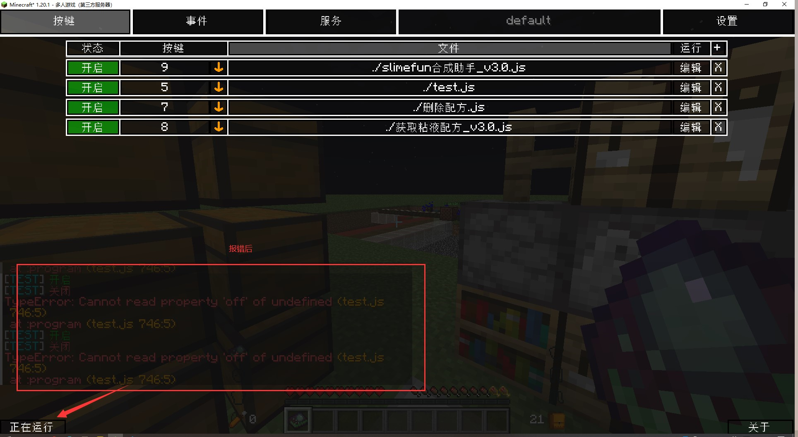
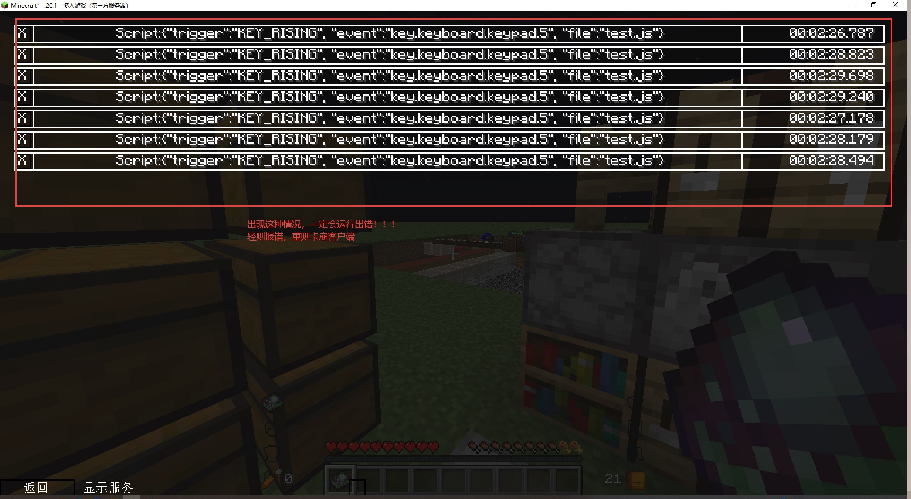

# 发布页面

目前可用版本：3.1.3及以下

## 更新信息
### 3.1.4 

重构队列计算逻辑，实现正确的制作顺序

> bug未修复，暂无法使用

### 3.1.3 

修改箱子取物方式，改为运行脚本时查看箱子库存

优化合成队列计算逻辑，合并相同物品，减小了队列存储长度

合成队列在某些情况下，原料制作顺序更靠后，导致出错

### 3.1.2 

修bug

适配某些服务器

### 3.1.1

修bug

### 3.0

重构id识别逻辑，修复 煤发电机 等翻译重复物品

增加箱子取物支持

## 使用前注意

由于JSMacros的多线程运行方式，如果一个脚本运行中未按预期运行，可能会导致卡进死循环，不能正常退出线程，此时一定要手动关闭所有正在运行的线程，不然会导致冲突

